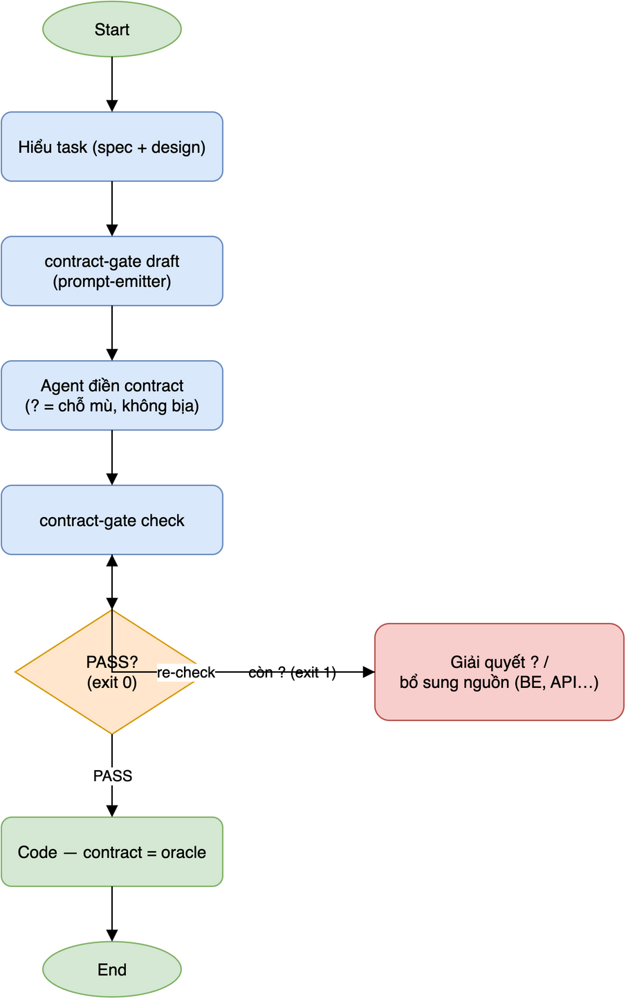

# contract-gate

**A project-agnostic pre-coding contract gate.** It enforces the discipline
**understand → contract → verify** *before* code is written — so an AI coding
agent (or a human in a hurry) can't amplify an ambiguous input into
confident-but-wrong code.

Point it at a repo; it discovers your contract files, runs every applicable
gate, and returns one verdict + exit code. Drop it into CI, a pre-commit hook,
or an agent's pre-BUILD step.

```bash
contract-gate check .        # exit 0 = all contracts sound, exit 1 = a gap
```

## The loop



Draft the contract from your spec/design, fill in the blind spots (unknowns stay
`?`), gate it. Anything unresolved fails the gate — you resolve it and re-check
*before* writing code, so the contract becomes the oracle you build against.
(Diagram source: [`docs/flow.drawio`](docs/flow.drawio).)

## Why this exists (and how it differs from the linters)

Tools like [agnix](https://github.com/agent-sh/agnix) and
[ctxlint](https://github.com/ctxlint/Ctxlint) answer *"is my config file
well-formed?"* — they lint `CLAUDE.md` / `AGENTS.md` / `SKILL.md`.

`contract-gate` answers a different question: **"did you actually understand
the problem before you started coding?"** It gates the *pre-coding contract*
(what data binds where, what the observable oracle is, which blind spots are
resolved) — the layer where migration and vibe-code bugs hide (a field wired to
the wrong source, a null that crashes the render, a spec section nobody pinned
down). No config linter checks that.

The discipline can't bake *understanding* (that's the human/agent part) — it
bakes the **guardrail**: a runnable line that says "pre-coding is sufficient →
go code", protecting against both under-prep (bugs) and over-prep (paralysis).

## Install

```bash
pipx install git+https://github.com/ducbm-amira/contract-gate   # (PyPI: planned)
# or, no install:
python3 -m contract_gate.cli check .
```

Zero runtime dependencies — the gates are Python-stdlib-only, so it runs under a
bare `python3` in any CI with no build chain.

## Quickstart

```bash
contract-gate init .          # scaffold example.<gate>.contract.md templates
$EDITOR example.data-binding.contract.md   # fill in the blind spots
contract-gate check .         # gate them
```

Or let your agent draft it from the source material, then gate the result:

```bash
contract-gate draft --gate data-binding --source spec.md --source design.html
# → emits a prompt (schema + your source + "mark unknowns with ?, don't invent")
#   paste into your agent, save the reply as *.contract.md, then:
contract-gate check .
```

`check` autodiscovers files named `*.contract.md` / `*.databinding.md` (and a
few conventional variants), runs every gate that *owns* the file (a gate skips
files it doesn't recognize — it never fails someone else's contract), and prints
a unified pass/fail with a one-line reason per contract. Exit `1` if any gate
fails, `0` otherwise. `--format json` for machine output. Add `--all` to list
**every** finding per contract at once (default stops at the first per file) —
useful when a fresh contract has many blind spots and you want them all up front
instead of one resolve-recheck cycle at a time.

## Gates

| Gate | Question it gates | Status |
|------|-------------------|--------|
| **`data-binding`** | Does every DATA element declare a source + null/empty handling? | ✅ shipped |
| **`greenfield`** | Does a design+spec task carry a 2-layer oracle (Design-ref + Observable per behavior)? + opt-in: did a human actually re-derive (not rubber-stamp) every non-🟢 row (D-06)? | ✅ shipped |
| **`manifest`** | Does a port have a Legacy Behavior Manifest with an observable per behavior? | ✅ shipped |
| **`golden-record`** | For a real record with a known answer, does the real running app's Actual value match the real DB/API's Expected value? | ✅ shipped |
| **`fidelity`** | Does every screen pinned in a fidelity contract have an already-run [`design-fidelity-gate`](https://github.com/ducbm-amira/design-fidelity-gate) bucketed report whose `overall` verdict is PASS? | ✅ shipped |
| **`testgen`** | Does every RTM row trace to a Requirement/Behavior and carry a real (or honestly-`?`) Expected/Oracle? | ✅ shipped |

`data-binding`/`greenfield`/`manifest` gate that a contract is *declared*
before code is written. `golden-record` and `fidelity` are a different kind
of gate: they verify a declared contract is *actually correct/matching*
against reality. `golden-record` checks one real record, queried straight
from the DB/API (Expected), against what the real running app displays for
it (Actual). `fidelity` checks that a screen's build actually matches its
design — but delegates the pixel/token comparison itself to
`design-fidelity-gate` (a separate tool with its own Playwright/pixelmatch/
coloraide dependency stack); this gate only grades the bucketed report JSON
that tool already wrote, the same way `golden-record` only grades values a
human/agent already captured. Nothing here drives a browser, a DB, or a
pixel-diff itself (that would break the zero-dep, agent-agnostic contract
and just relocate the "trust me" problem). See
[`contract_gate/gates/golden_record.py`](contract_gate/gates/golden_record.py)
(GOLD-01..05) and
[`contract_gate/gates/fidelity.py`](contract_gate/gates/fidelity.py)
(FID-01..08) for the full rationale.

A real fidelity contract is named `<screen>.fidelity.md` (e.g.
`deal-map.fidelity.md`) — deliberately NOT `*.contract.md`, so a fresh
`contract-gate init` scaffold (which has no real report yet) doesn't
self-discover and self-fail:

```markdown
| Screen | Report |
|--------|--------|
| deal-map | cache/_reports/deal-map.report.json |
```

```bash
python -m verdict --screen deal-map --out cache/_reports/deal-map.report.json  # design-fidelity-gate, run first
contract-gate check .                                                          # then gate it
```

### `testgen` — the odd one out: usually draft-inferable

`testgen` is the mid-code test-coverage gate: an RTM (Requirements
Traceability Matrix) where every row traces to a Requirement/Behavior and
carries a real Expected/Oracle, derived with formal test-design technique
(EP/BVA/decision tables/state-transition/pairwise — the `senior-qa`
discipline, baked into `draft --gate testgen`'s guidance as portable prose).
Unlike `golden-record`/`fidelity`, where `?` is expected far more often than
not, here the spec/design usually DOES pin the correct behavior — so `?` in
Expected is the exception, reserved for a genuine spec gap, not a default.
A real RTM file is named `<task>.testgen.md` (not `.testgen.contract.md`,
same self-collision guard as `fidelity`). See
[`contract_gate/gates/testgen.py`](contract_gate/gates/testgen.py)
(RTM-01..07).

## `draft` — drafting the contract (the adoption unlock)

Writing a contract by hand is the friction that kills cold-adoption. `draft`
removes it **without** adding an LLM dependency: contract-gate stays zero-dep
and agent-agnostic by acting as a **prompt-emitter**, not an LLM client. You
already work inside an agent — `draft` assembles the schema + your source
material + focused guidance into one prompt; the agent drafts, you review, the
gate verifies.

```bash
contract-gate draft --gate data-binding --source spec.md   # prompt → stdout
contract-gate draft --gate data-binding --source spec.md --via "claude -p"  # optional: pipe to a local LLM CLI, save the reply
```

The prompt is engineered so the draft **can't game the gate**: it instructs the
model to write `?` for any source it cannot derive from the material and to
never invent an endpoint/field — so real blind spots surface (the gate fails on
`?`) instead of being papered over. AI drafts the derivable 80%; the risky 20%
still lands on a human. (DP3 + DP4.)

### `data-binding` — the shipped gate

A markdown table (Screen × Element × {type; source; format; null}). Only rows
you classify (or leave unclassified) as **data** are gated:

1. every data element must declare a non-empty **source** (`ô data chưa ghi
   nguồn = chưa cho build`);
2. the map must **track null/empty handling** for data, and each data row fills
   it (a null nobody thought about is the #1 migration crash);
3. **format** is required only if you add a format column (optional to track).

Static rows (title/label/image/icon/action/state) are skipped; an unknown type
is treated as data (a false PASS defeats the gate; a false FAIL just costs a
relabel). `N/A` is a filled, considered value; `?`/`TODO`/`-` count as unfilled.
Live example: [`examples/DATA-BINDING.md`](examples/DATA-BINDING.md).

## Use in CI

```yaml
- run: pipx run contract-gate check .   # fails the job on exit 1
```

## Add a gate

A gate is one module in `contract_gate/gates/` exposing a small descriptor —
`KEY`, `TITLE`, `GLOBS`, `applies(text) -> bool`, `evaluate(text) -> (ok, reason)`,
and a `TEMPLATE` string — then one line in `gates/__init__.py::REGISTRY`. See
[`contract_gate/gates/data_binding.py`](contract_gate/gates/data_binding.py) as
the reference. Keep it stdlib-only and format-forgiving (no regex, no network).

## Design principles

- **DP1** — spec only the blind spots, not everything (over-spec = form-cứng +
  doc bloat; 80% of a screen is obvious).
- **DP2** — prefer executable checks over prose (tests self-verify).
- **DP3** — doc-time must be small + net-saving; AI drafts, human reviews.
- **DP4** — a spec is a hypothesis; pair it with a real oracle. This gate pins
  that a source is *declared*; a golden-record check verifies the wiring is
  *correct*.
- **DP5** — "AI drafts, human reviews" (DP3) is not enough on its own: a human
  can review by skimming and still rubber-stamp a row they never really
  verified (automation bias) — a more expensive failure than a blank `?`,
  because it *looks* sourced and ships wrong anyway. Where a gate's contract
  carries real inference (not just declared-or-not), pair AI's citation with
  a **cognitive forcing function** — make the human restate the row in their
  own words before it counts as reviewed, so silence/copy-paste stops
  passing as agreement. See `greenfield`'s opt-in Confidence/Restated columns
  (D-06 in [`contract_gate/gates/greenfield.py`](contract_gate/gates/greenfield.py)).

Full requirement history: [`docs/TOOL-REQUIREMENTS.md`](docs/TOOL-REQUIREMENTS.md).
The `examples/` folder is one complete pre-coding pass on a real task.

## License

MIT.
